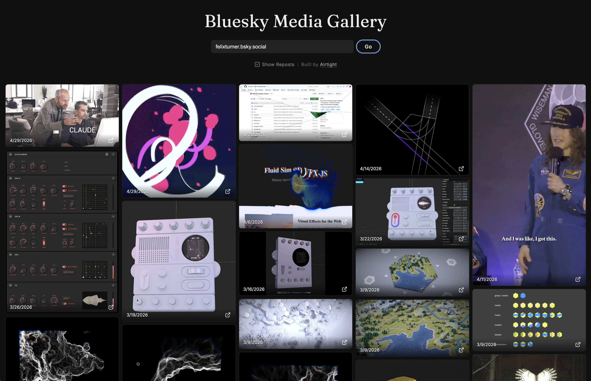
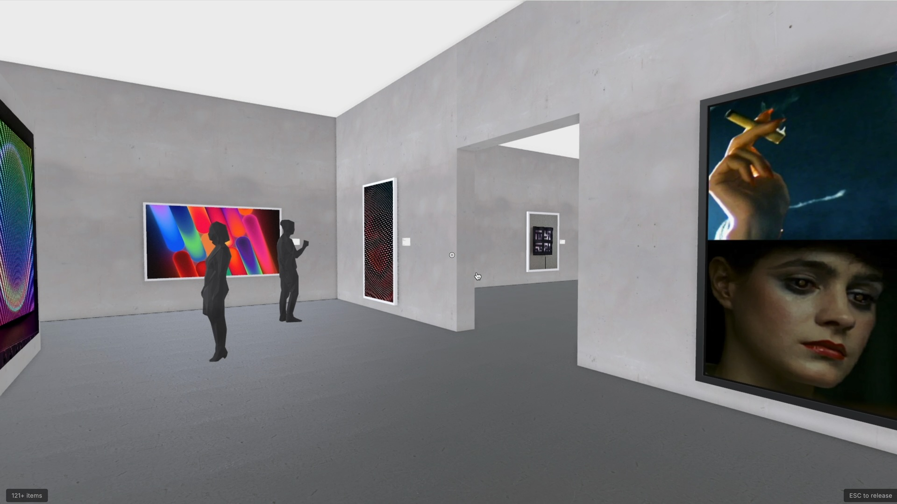

# Bluesky Gallery

Two ways to look at a Bluesky user's media: a **2D masonry web gallery** and an
**immersive 3D art gallery** with first-person controls.

## 2D gallery



A masonry layout of a user's images and videos with inline auto-playing,
muted-looped videos and a click-to-zoom lightbox.

**Live demo:** <https://felixturner.github.io/bsky-gallery/>

## 3D gallery



A first-person walk-through of a Bluesky user's feed, rendered as a procedural
museum: alternating big and small rooms strung along a Z-axis, with the trio
ahead of you recycled in/out as you cross doorways so the gallery is
effectively endless.

**Live demo:** <https://felixturner.github.io/bsky-gallery/3d/>

Highlights:

- **Endless treadmill** of 5 alternating big/small rooms; new rooms build and
  old ones recycle as you cross doorways. End-of-feed terminates with a small
  capped room.
- **Generative frames + sets** — multi-image bsky posts share frame styling
  and a uniform target height per slot type, so a 4-image post reads as a
  series.
- **People** — random characters drawn from a GLB pool, placed in front of
  random artworks; fade out as you approach.
- **Audio** — looped ambience + footsteps when moving; per-video volume
  falloff with a directional check (no audio leaking through partition walls).
- **Player collisions** so you can't walk through walls.
- **WebGPU + TSL postprocessing** with GTAO, optional spotlights, IBL.
- **HLS adaptive video** pinned to the highest variant + WebGPU-aware
  texture allocation so portrait clips tagged as landscape (and vice versa)
  rebuild geometry once real dimensions are known.

Controls: WASD / arrows to move, mouse to look, ESC to release pointer lock.

## Repo layout

```
gallery2d/   — Vite + vanilla JS masonry gallery (deployed to GitHub Pages)
gallery3d/   — Vite + Three.js (WebGPU) first-person 3D gallery
worker/      — Cloudflare Worker proxy that adds CORS headers to bsky CDN
docs/        — screenshots
```

Each gallery is an independent Vite project with its own `package.json`.

## Run locally

```sh
# 2D
cd gallery2d
npm install
npm run dev

# 3D
cd gallery3d
npm install
npm run dev
```

## How it works

Both apps fetch a user's media via the public Bluesky AppView API
(`app.bsky.feed.getAuthorFeed`) and render whatever embeds the post contains:

- **Images** (`app.bsky.embed.images`) — direct CDN URLs from `cdn.bsky.app`
- **Videos** (`app.bsky.embed.video`) — HLS playlists from `video.bsky.app`,
  played via [hls.js](https://github.com/video-dev/hls.js) (or native HLS on
  Safari)
- **Externals** (`app.bsky.embed.external`) — YouTube embeds, Tenor GIFs,
  link previews (2D only)

A Cloudflare Worker (`worker/`) proxies the CDN responses with CORS headers so
WebGL/WebGPU textures aren't tainted in production. In dev, the Vite dev
server proxies the same paths.

## License

[Creative Commons Attribution-NonCommercial-ShareAlike 4.0 International (CC BY-NC-SA 4.0)](https://creativecommons.org/licenses/by-nc-sa/4.0/)
— see [LICENSE](LICENSE). You're welcome to use, modify, and share this for
non-commercial purposes; derivatives must use the same license.

## Built by

[Airtight](https://airtight.cc)
